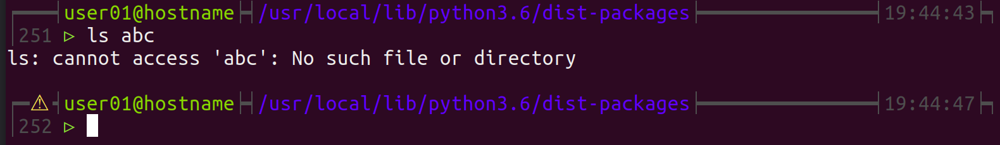
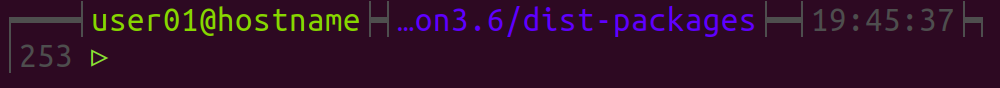

# miscellaneous
Scripts, stuff...

## My $PS1
My prompt bash command on Ubuntu 17.10
history number, and exit status (>0 = ⚠ ) 



responsive :




copy/past this content to your ~/.bashrc script for user and root :

```bash
function __prompt_command() {
    local EXIT="$?"
    echo ""
    PS1=""
    local user_len=${#USER}
    local host_len=${#HOSTNAME}
    local pwd_str=$(dirs)
    local pwd_len=${#pwd_str}

    # colors
    #local cend='\]'
    local coL='\[\033[38;5;239m\]'  # line
    local coUH='\[\033[38;5;112m\]'
    local coP='\[\033[38;5;57m\]'
    local coE='\[\033[38;5;11m\]'
    local coR='\[\033[38;5;1m\]'
    local coU='\[\033[38;5;10m\]'
    local coD='\[\033[38;5;15m\]'

    local long=22  # nb of static characters 

    if [ $EXIT -gt 0 ]; then
        local error_sym="$coE⚠ "  #❎
    else
        local error_sym="$coL━━"
    fi
    
    if [ $UID -eq 0 ]; then
        local priv_sym="$coR▸"
    else
        local priv_sym="$coU▹"
    fi

    local path_cut_str='…'
    local path_cut_len=${#path_cut_str}

    local l_line_oversize=$(( COLUMNS - user_len - host_len - pwd_len - long ))
    
    if [ $l_line_oversize -lt 0 ]; then
        pwd_str=${pwd_str:$(( -1 * l_line_oversize  ))}
        PS1="$coL┍━$error_sym$coL┥$coUH\u@\h$coL┝┥$coP$path_cut_str$pwd_str$coL┝━┥\t┝┑\n│\! $priv_sym $coD"
    else
        local nlines=$(eval printf %.0s━ '{-1..'$(( l_line_oversize ))})
        PS1="$coL┍━$error_sym$coL┥$coUH\u@\h$coL┝┥$coP$pwd_str$coL┝$nlines┥\t┝┑\n│\! $priv_sym $coD"
    fi
}

export PROMPT_COMMAND=__prompt_command
```
